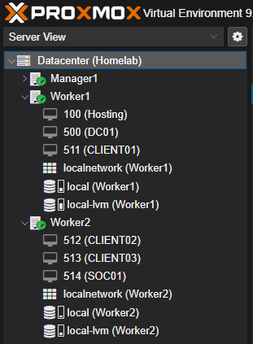
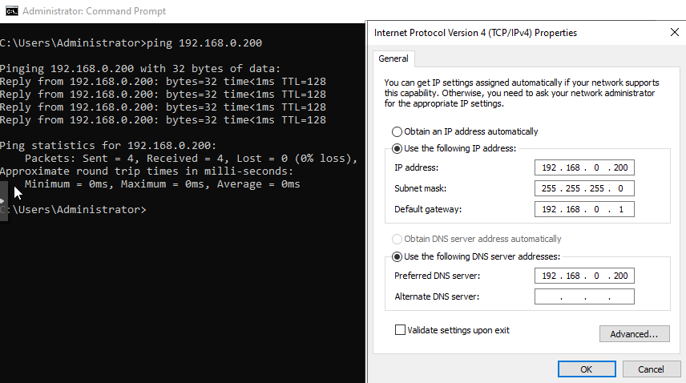
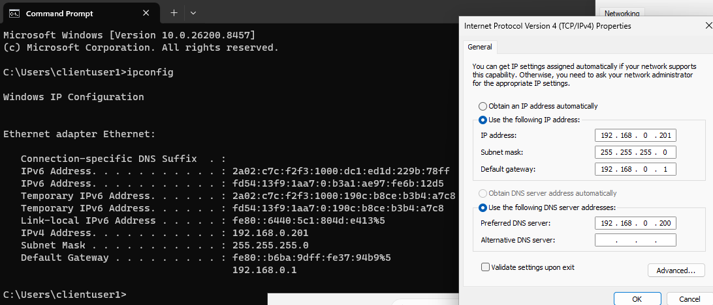

# Infrastructure Deployment

## Overview

This phase was focused on designing and deploying the virtual infrastructure required to support the entire project to allow for a enterprise style security monitoring environment.

The objective was to create a closely realistic Windows enterprise environment where identity management, endpoint administration, security controls and centralised monitoring could be implemented and tested.

The infrastructure was deployed using a Proxmox virtualisation cluster phsycially available to me which consisted of multiple physical nodes. This provided a flexible platform for deploying, managing and modifying virtual machines throughout the project timeline

The completed environment consists of:

- Windows Server 2022 domain controller
- 3 Windows 11 domain-joined endpoints
- Dedicated Ubuntu Server for security monitoring purposes
- Virtual networking supporting enterprise communication practices
- Centralised security monitoring through Wazuh SIEM tool

The environment was designed to replicate a small enterprise network where administrators manage users, devices and security telemetry through centralised services.

---

## Lab Objectives

The primary objective of this environment was to simulate the core components of a small enterprise IT and Security Operations environment.

Where the lab was designed to achieve the following objectives such as:

- Deploy and manage a virtualised enterprise infrastructure
- Implementing Active Directory Domain Services for centralised identity management
- Configuring Windows workstation endpoints within a domain environment
- Applying centralised security policies using Group Policy Objects (GPOs)
- Collect endpoint security telemetry using Sysmon
- Forward security events to a centralised SIEM platform along with sysmon ingestion
- Developing a foundation for future security monitoring and incident response exercises

By building the environment from the planning the infrastructure layer upwards, each component could tested individually allowing better learning before integrating additional security capabilities.

---

## Proxmox Environment

The infrastructure was built using a three-node Proxmox cluster homelab which consists of one management node and two worker nodes.

Proxmox was selected as the virtualisation platform because it provides enterprise-style features including:

- Virtual machine management
- Cluster administration
- High availability capabilities
- Resource allocation
- Network configuration
- Snapshot and recovery functionality

The cluster design allows different systems to be deployed, isolated and tested without impacting the underlying host environment while allowing for easy snapshots and recovery if needed at any stage within testing.

The management node provides cluster coordination and quorum functionality, while the worker nodes host the virtual machines used throughout the security monitoring environment.

---

## Cluster Architecture

The Proxmox environment consists of:

| Node | Purpose |
|---|---|
| Manager Node | Cluster management, quorum services and administration |
| Worker 1 | Hosts the domain controller and first Windows endpoint |
| Worker 2 | Hosts additional endpoints and security monitoring endpoint |

The separation of management and workload resources allows the environment to replicate a simplified enterprise virtualisation architecture.

---

## Virtual Machine Deployment

The final virtual machine allocation after planning was:

| Virtual Machine | Operating System | Role | IP Address | Host Node |
|---|---|---|---|---|
| DC01 | Windows Server 2022 | Active Directory Domain Controller / DNS Server | 192.168.0.200 | Worker 1 |
| CLIENT01 | Windows 11 Pro | Domain Endpoint | 192.168.0.201 | Worker 1 |
| CLIENT02 | Windows 11 Pro | Domain Endpoint | 192.168.0.202 | Worker 2 |
| CLIENT03 | Windows 11 Pro | Domain Endpoint | 192.168.0.203 | Worker 2 |
| SOC01 | Ubuntu Server 24.04 | Wazuh SIEM Platform | 192.168.0.210 | Worker 2 |

The workload distribution was based on available resources within the lab environment while maintaining logical separation between enterprise endpoints and security monitoring infrastructure.

(Proxmox interface showing the deployed virtual machines and distrubitions across the worker nodes)

---

## Network Architecture

The lab environment was designed using a structured IP addressing approach to simplify administration, troubleshooting and future expansion.

The network was deployed within the `192.168.0.0/24` private address range, with dedicated address allocations for domain infrastructure, endpoints and security monitoring systems.

The addressing scheme was organised as follows:

| IP Range | Purpose |
|---|---|
| 192.168.0.200 | Domain Controller infrastructure |
| 192.168.0.201 - 192.168.0.203 | Windows endpoint workstations |
| 192.168.0.210 | Security monitoring infrastructure |
| 192.168.0.211 - 192.168.0.230 | Reserved for future expansion |

This structure provides predictable addressing for critical services while allowing additional systems to be introduced without redesigning the network.

---

## Static IP Configuration

Static IP allocation was required and used across all machines because several services within the environment depend on predictable network communication, including:

- Active Directory Domain Services
- DNS resolution
- Wazuh agent communication
- Endpoint monitoring

The following static configurations were applied:

| System | IP Address | DNS Configuration |
|---|---|---|
| DC01 | 192.168.0.200 | Points to itself (192.168.0.200) |
| CLIENT01 | 192.168.0.201 | Uses DC01 as DNS (192.168.0.200) |
| CLIENT02 | 192.168.0.202 | Uses DC01 as DNS (192.168.0.200) |
| CLIENT03 | 192.168.0.203 | Uses DC01 as DNS (192.168.0.200) |
| SOC01 | 192.168.0.210 | Uses DC01 as DNS (192.168.0.200) |

The domain controller was configured as the primary DNS server because Active Directory relies heavily on DNS for locating domain services, authentication and communication between domain members.

---

## DNS Design

Active Directory environments rely on DNS to locate domain controllers and associated services.

DC01 was configured as both:

- Active Directory Domain Controller
- DNS Server

Client machines were configured to use DC01 as their DNS resolver rather than external DNS servers. as this ensures domain-connected devices query the internal DNS infrastructure when resolving:

- Domain names
- Domain controllers
- Authentication services
- Internal resources

The environment uses the internal domain: (Corp.Local)
DNS resolution was validated before joining client systems to the domain to ensure reliable Active Directory communication.

DC01 configured with a static IP address and configured to provide DNS services for the Active Directory environment.

Windows workstations were also configured with static addressing and directed to the domain controller for primary DNS resolution.

---

## DNS Troubleshooting

During initial validation, client machines experienced inconsistent DNS resolution when attempting to locate the `corp.local` domain.

Investigation identified IPv6 configuration as interfering with expected DNS resolution behaviour within the isolated lab environment.

As a temporary lab workaround, IPv6 was disabled on client systems to ensure IPv4 DNS queries were correctly directed towards DC01.

In a production environment, IPv6 would not normally be disabled. Instead, it would be correctly configured alongside IPv4 to support modern enterprise networking requirements.

After adjustment, DNS functionality was validated using:

- Ping tests
- nslookup queries
- Domain resolution checks

however for future services and possible imporvements on the enviornment IPv6 will be renabled and properly configurated to work alongside IPv4.
