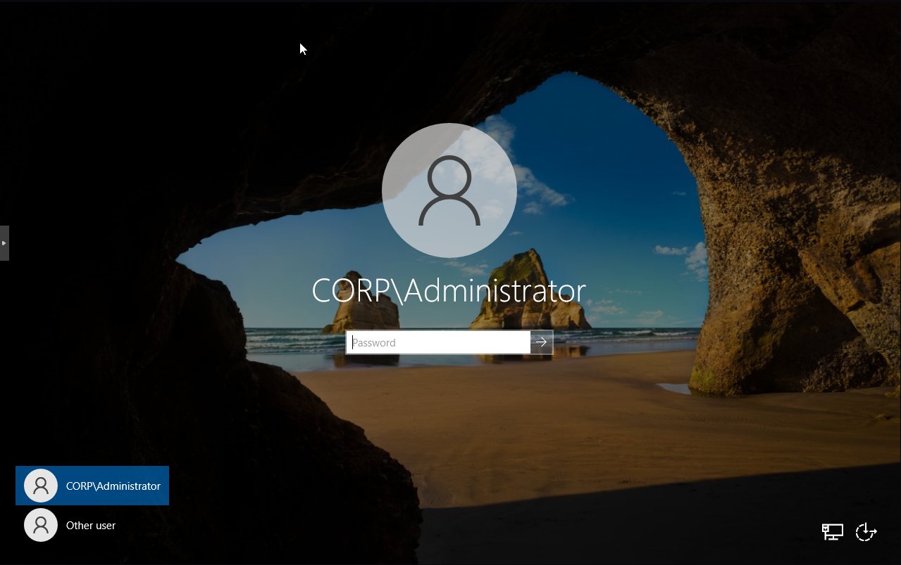
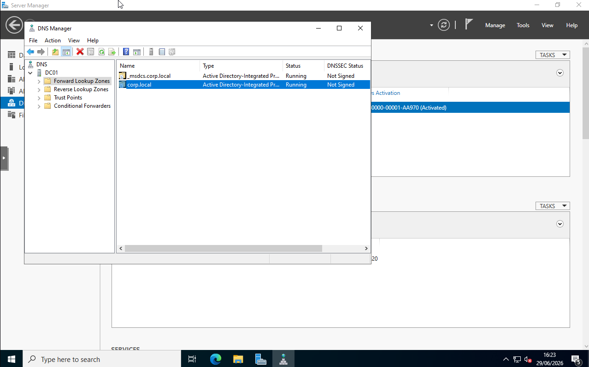
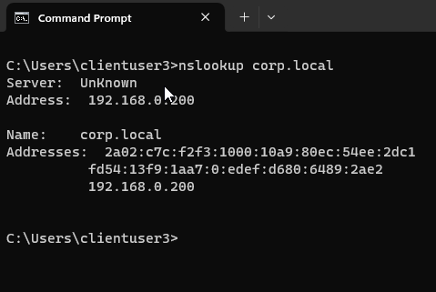
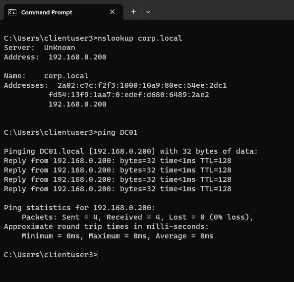
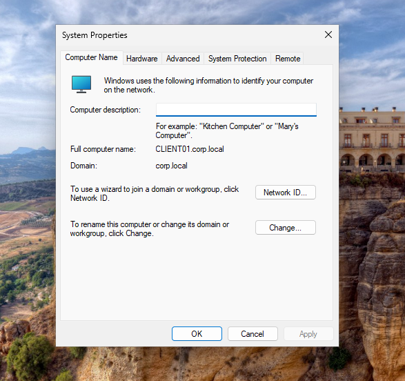
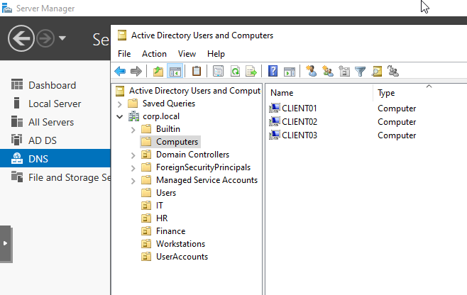

# Active Directory Deployment & Environment Overview

Active Directory was deployed for identity and management foundations of the enterprise security monitoring environment.

The objective was to create a realistic Windows enterprise environment where users, computers, authentication and security policies could be centrally managed before implementing endpoint monitoring and SIEM capabilities.

Active Directory provides the identity layer of the environment, allowing:

- Centralised user authentication
- Domain-based workstation management
- Role-based access control (RBAC)
- Group Policy security enforcement
- Centralised auditing and monitoring

The Active Directory environment was designed to simulate a small enterprise network consisting of:

- One Windows Server 2022 Domain Controller
- Three Windows 11 domain-joined workstations
- Multiple departments and user accounts
- Security groups for access control
- Group Policy Objects for security configuration

The completed environment provides the foundation required for later security monitoring components, including Sysmon endpoint telemetry and ingestion along with Wazuh SIEM integration.

The overall security architecture follows the flow:
- Users
- Active Directory Authentication
- Group Policy Security Controls
- Windows Endpoints
- Sysmon Telemetry
- Wazuh Security Monitoring

---

## Domain Environment Design

The design focuses on providing centralised identity management, endpoint administration and security policy enforcement across multiple domain-connected machines. where the environment uses a single Active Directory forest and domain:
(Corp.local)

The `corp.local` domain was selected as an internal lab domain to represent a corporate enterprise environment. providing dedicated namespace for managing users, computers, authentication services and security policies within the simulated organisation.

The Active Directory deployment consists of:

| System | Operating System | Role |
|---|---|---|
| DC01 | Windows Server 2022 | Domain Controller, Active Directory Domain Services, DNS Server |
| CLIENT01 | Windows 11 | Domain-joined workstation |
| CLIENT02 | Windows 11 | Domain-joined workstation |
| CLIENT03 | Windows 11 | Domain-joined workstation |

The domain controller provides:

- Active Directory Domain Services (AD DS)
- DNS services
- Authentication services
- User and computer management
- Group Policy management

## Forest and Domain Structure

A single forest and single domain architecture was implemented.

Structure:
Forest:
corp.local

Domain:
corp.local

A single-domain structure was selected because the objective of this environment was to simply simulate a standard enterprise identity environment while maintaining appropriate complexity for security monitoring and detection engineering.

In larger organisations, multiple forests or domains may exist due to business requirements such as mergers, regulatory requirements or security boundaries. However, a single forest design is best suited for this simulated enterprise environment.

---

## Domain Controller Design

DC01 was configured as the primary domain controller for the environment.

Responsibilities include:

- Hosting Active Directory Domain Services
- Providing DNS resolution for domain members
- Authenticating domain users
- Managing organisational units
- Applying Group Policy Objects
- Collecting security-related events for monitoring

In production environments, multiple domain controllers would typically be deployed to provide:

- High availability
- Fault tolerance
- Authentication redundancy
- Disaster recovery capability

---

## Active Directory Domain Controller Validation

Following the promotion process, DC01 was restarted and validated to confirm that Active Directory Domain Services had been successfully deployed.

After the restart, the Windows login screen changed from the local administrator format to the domain authentication format:
(CORP\Administrator)
This confirmed that DC01 was now operating as a domain controller within the newly created `corp.local` domain.

The login screen confirms that DC01 is now authenticating against the `CORP` domain rather than using a standalone local account.

---

## Active Directory Users and Computers Validation

Active Directory Users and Computers (ADUC) was opened to verify that the `corp.local` domain had been successfully created.

The console displayed the default Active Directory containers and confirmed that the domain structure was available for user, computer and organisational unit management.

ADUC confirmed that the `corp.local` domain was successfully created and available for administration.

---

## DNS Validation

Because Active Directory relies on DNS for service discovery, the DNS Server role was validated after domain controller promotion.

The DNS Forward Lookup Zone was checked to confirm that the `corp.local` zone had been created successfully.

The zone contained the required domain records allowing domain members to locate Active Directory services.

The DNS Forward Lookup Zone confirms that the internal `corp.local` namespace was successfully created.

---

## Domain Controller Validation Result

DC01 was successfully deployed as the first domain controller for the `corp.local` Active Directory environment.

Validation completed:

- Active Directory Domain Services installed
- Domain controller promotion completed
- Domain authentication available
- Active Directory Users and Computers accessible
- DNS  created successfully

The next stage was preparing the Windows client machines for domain membership by validating DNS configuration and joining them to the `corp.local` domain.

---

## Client Domain Preparation and Joining

Before joining the Windows endpoints to the `corp.local` domain, network configuration was validated to ensure that each client could correctly communicate with DC01.

For Active Directory domain membership to function correctly, the client machines required:

- Correct static IP configuration
- DC01 configured as the DNS server
- Network connectivity to the domain controller
- Successful DNS resolution of the domain

The following configuration was verified across CLIENT01, CLIENT02 and CLIENT03:

| System | IP Address | Gateway | DNS Server |
|---|---|---|---|
| CLIENT01 | 192.168.0.201 | 192.168.0.1 | 192.168.0.200 |
| CLIENT02 | 192.168.0.202 | 192.168.0.1 | 192.168.0.200 |
| CLIENT03 | 192.168.0.203 | 192.168.0.1 | 192.168.0.200 |

All client machines were configured to use DC01 as their primary DNS resolver.

---
## DNS Connectivity Testing

Before domain joining, DNS functionality was tested from the client machines.

The following validation commands were performed:
- ping 192.168.0.200

(to confirm network connectivity with DC01.)
- nslookup corp.local

(to confirm that clients could resolve the Active Directory domain through the internal DNS server.)

- ping DC01

(to confirm network connectivity with DC01.)

## DNS Resolution Troubleshooting

During initial validation, client machines experienced inconsistent DNS resolution when querying the `corp.local` domain.

Although DC01 was correctly configured and the DNS zone existed, client queries did not consistently resolve through the domain controller.

Further investigation identified IPv6 configuration as interfering with expected DNS behaviour within the isolated lab environment.

As a temporary lab workaround, IPv6 was disabled on the Windows client machines to ensure that DNS queries were correctly directed through the IPv4 DNS configuration pointing to DC01.

After this adjustment, DNS resolution was retested successfully.

DNS testing confirmed that client machines could resolve the `corp.local` domain and communicate with DC01 before joining the domain.

---

## Domain Joining Client Machines

After validating network communication and DNS resolution, CLIENT01, CLIENT02 and CLIENT03 were joined to the `corp.local` Active Directory domain.

The domain join process was completed through:
System Properties → Computer Name → Change → Domain → corp.local

The client workstation was successfully joined to the `corp.local` domain.

---

## Domain Membership Verification

After restarting, domain membership was verified by checking the workstation system information.

Validation confirmed:

- Computer name correctly assigned
- Domain displayed as `corp.local`
- Domain authentication available

The domain controller was also checked through Active Directory Users and Computers to confirm that CLIENT01, CLIENT02 and CLIENT03 appeared within the Computers container.

Active Directory Users and Computers confirmed that all three Windows endpoints were registered as domain members.
