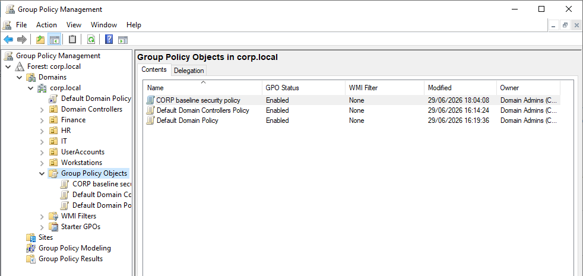
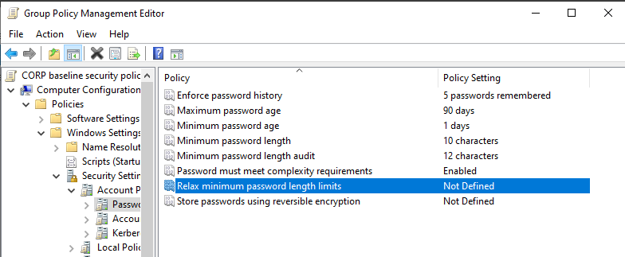
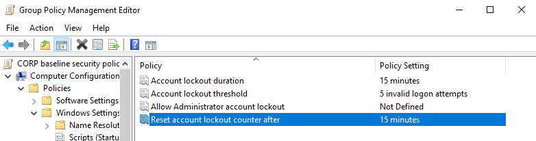
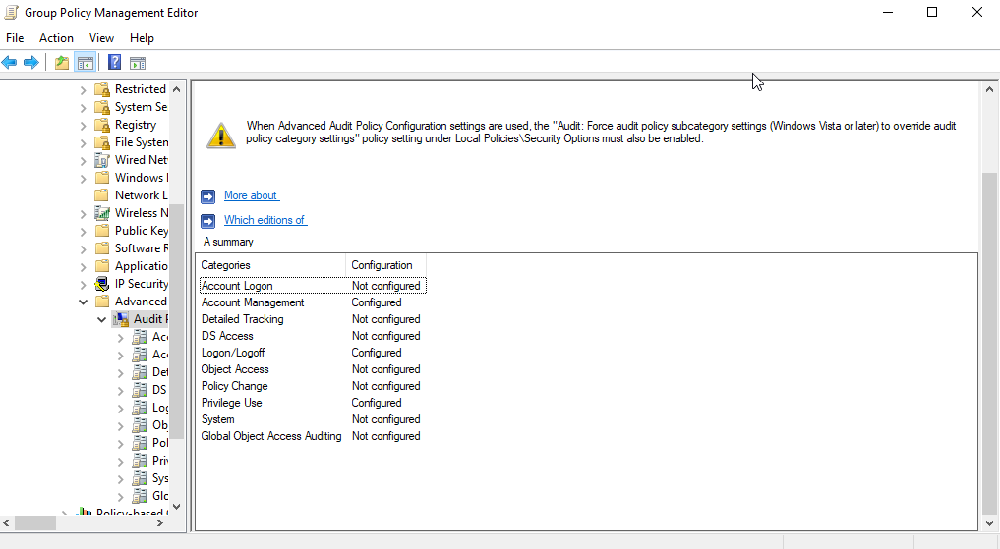
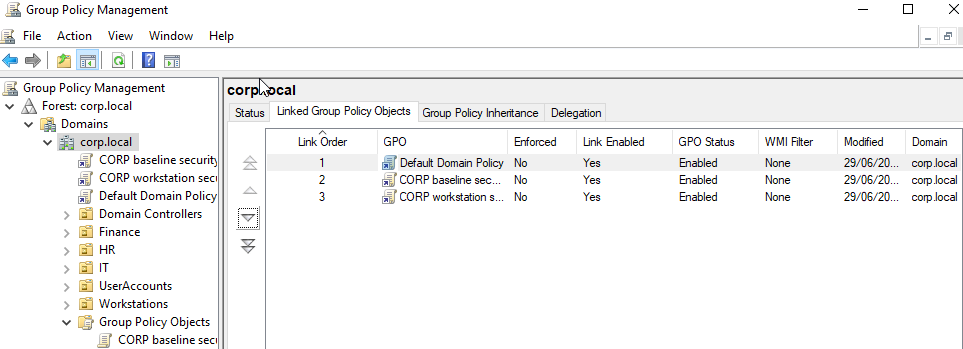
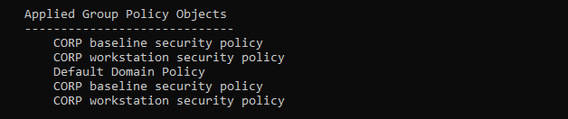
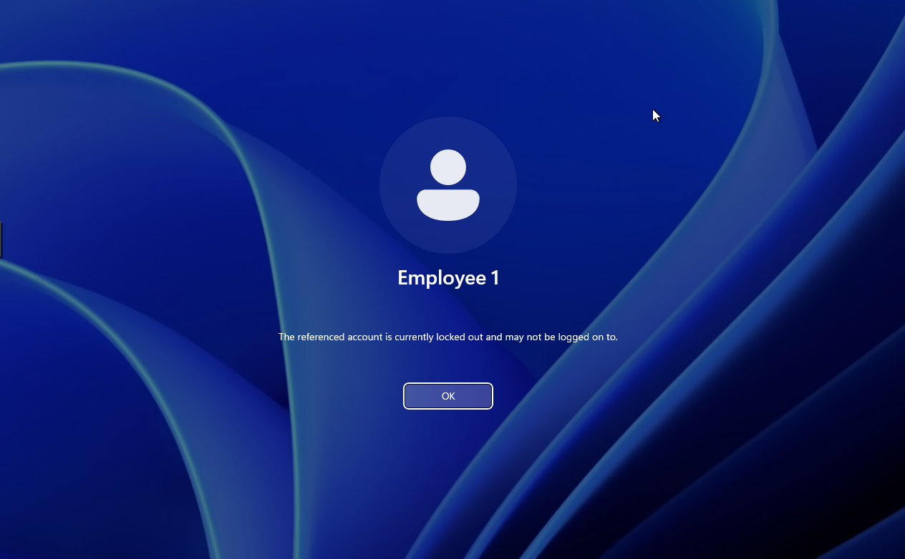
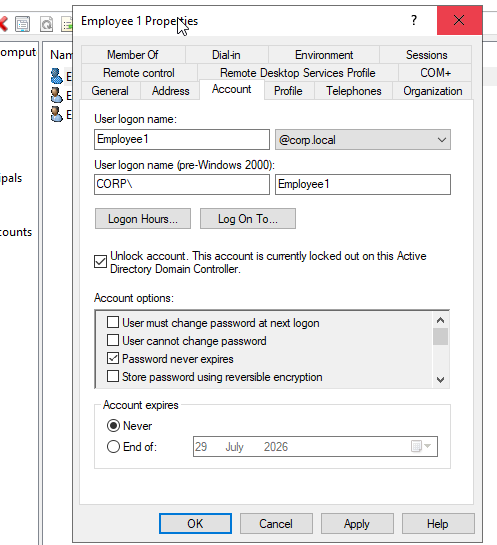

# Group Policy Security Controls

After establishing the Active Directory identity structure, Group Policy Objects (GPOs) were implemented to provide centralised security management across the domain.

Group Policy allows administrators to configure security settings, user restrictions and workstation behaviour from a central management location rather than manually configuring each endpoint.

In an enterprise environment, this allows security controls to be deployed consistently across hundreds or thousands of devices.

The objectives of this phase were:

- Enforce stronger authentication requirements
- Reduce the risk of password-based attacks
- Implement account lockout protections
- Enable security auditing
- Prepare endpoints for future security monitoring through Sysmon and Wazuh

## Security Baseline Group Policy Object

A dedicated Group Policy Object was created:
(CORP Baseline Security Policy)

This GPO was designed to contain domain-wide security configurations that would apply to all managed Windows endpoints.

Creating a dedicated security baseline allows future security policies to be managed separately from default Active Directory policies.

The CORP Baseline Security Policy GPO was created within Group Policy Management.

---

## Password Policy Configuration

The first security control implemented was a domain password policy.

Password policies help reduce the likelihood of weak credentials being used to compromise user accounts.

The following settings were configured:

| Setting | Value |
|---|---|
| Minimum password length | 10 characters |
| Minimum password length audit | 12 characters |
| Maximum password age | 90 days |
| Minimum password age | 1 day |
| Password history | 5 previous passwords |
| Complexity requirements | Enabled |

The minimum password length audit setting was enabled to identify accounts that may not meet future security requirements without immediately impacting authentication.
## Enterprise Consideration

The values used within this lab represent a security baseline rather than a complete enterprise password strategy.

Production environments may enforce stronger requirements depending on:

- Organisation security policies
- Regulatory requirements
- Identity provider configuration
- Risk assessment outcomes

Modern environments may also supplement password controls with:

- Multi-factor authentication (MFA)
- Conditional access policies
- Privileged access management
- Passwordless authentication

Domain password requirements configured through Group Policy.

---

## Account Lockout Policy

To reduce the risk of password guessing and brute-force authentication attempts, account lockout controls were configured.

The following settings were applied:

| Setting | Value |
|---|---|
| Account lockout threshold | 5 failed attempts |
| Account lockout duration | 15 minutes |
| Reset account lockout counter | 15 minutes |

These controls simulate a common enterprise defence against repeated authentication failures.
## Security Purpose

Account lockout policies help reduce:

- Automated password guessing
- Brute-force attacks
- Repeated authentication abuse

However, in production environments, lockout policies must be carefully balanced as aggressive settings can also introduce denial-of-service risks by allowing attackers to intentionally lock accounts.

Account lockout controls configured within the domain security policy.

---

## Windows Security Auditing Configuration

A second Group Policy Object was created to enable enhanced auditing across domain-connected workstations.

The purpose of this policy was to increase visibility into security-relevant activity before integrating endpoint telemetry into Sysmon and Wazuh.

The following audit categories were enabled:

| Audit Category | Purpose |
|---|---|
| Logon Success | Tracks successful authentication events |
| Logon Failure | Detects failed authentication attempts |
| Logoff Events | Tracks user session termination |
| Account Lockout | Records locked accounts |
| User Account Management | Tracks account creation and modification |
| Sensitive Privilege Use | Monitors privileged activity |

Windows auditing settings enabled to provide security telemetry for later monitoring.

---

## Applying Group Policy Configuration

After configuring the required security settings, the GPOs were linked to the domain to allow inheritance by domain-connected systems.

The configured policies were:

- CORP Baseline Security Policy
- CORP Workstation Security Policy

Linking policies at the domain level ensures that connected workstations receive the required security configuration automatically.

Security policies linked to the Active Directory domain.

---

## Group Policy Deployment Validation

After linking the policies, updates were manually forced on client machines using:
`gpresult /force`

This allowed the newly created policies to apply immediately rather than waiting for the default refresh interval.
The applied policies were verified using:
`gpresult /r`

This confirmed that the expected Group Policy Objects were successfully applied to the endpoints.

Successful Group Policy refresh on domain-connected endpoints.

---

## Security Control Testing

To validate that the account lockout policy functioned correctly, multiple incorrect authentication attempts were intentionally performed against a test account.

After exceeding the configured threshold:

- The account became locked
- Authentication attempts were rejected
- The lockout event was recorded

The account was then manually unlocked through Active Directory Users and Computers.

This demonstrated that the configured authentication controls were functioning correctly.

Account lockout policy successfully triggered after repeated failed authentication attempts.

Locked account restored through Active Directory administration.

---

## Group Policy Implementation Result

Completed:

✓ Domain password policy configured  
✓ Account lockout protection enabled  
✓ Windows security auditing enabled  
✓ GPOs linked to domain  
✓ Policies applied to endpoints  
✓ Security controls validated through testing  

The Active Directory environment now contained:

Identity:
- Active Directory users
- Security groups
- Domain authentication

Management:
- Organisational Units
- Group Policy Objects

Security Controls:
- Password enforcement
- Account lockout protection
- Audit logging

The next phase introduced endpoint telemetry collection using Sysmon to provide deeper visibility into system activity.
