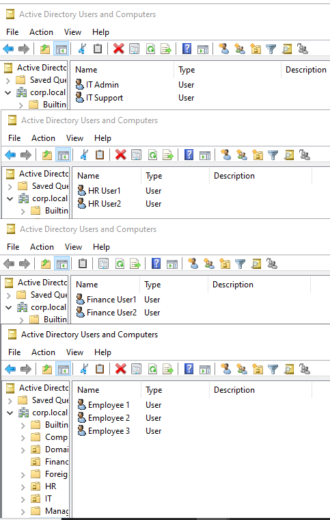
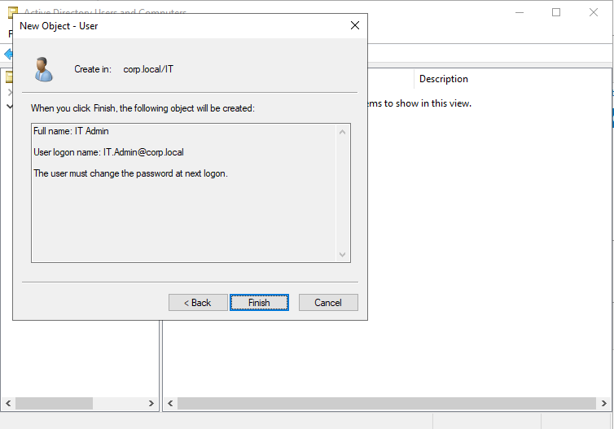
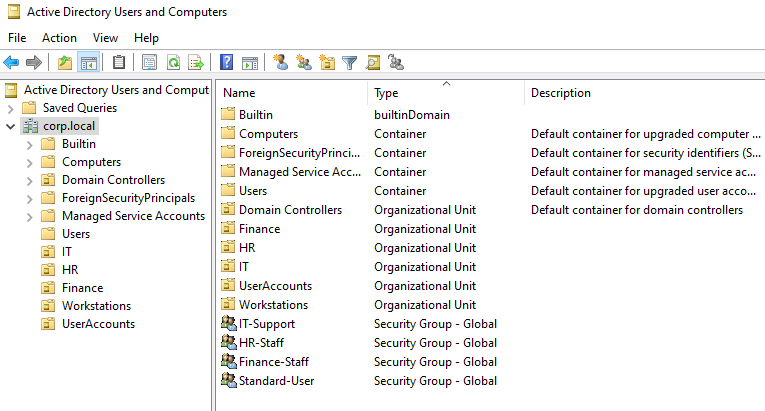

# Organisational Unit Structure

After successfully joining the Windows endpoints to the domain, the Active Directory structure was organised using custom Organisational Units (OUs).

OUs were created to provide logical separation between users, computers and departments. This structure allows administrators to apply targeted Group Policy settings, delegate permissions and manage resources more efficiently.

The OU structure created was:
Corp.local:
- IT
- HR
- Finance
- Workstations
- UserAccounts

The structure was designed to represent a simplified enterprise environment containing separate departments and managed workstation objects.

---

## OU Design Decisions

The default Active Directory containers created during domain installation were not used as the primary management structure.

Instead, dedicated Organisational Units were created to provide improved administration and future scalability.

The OU purposes were:

| OU | Purpose |
|---|---|
| IT | Contains IT department accounts and administrative users |
| HR | Contains HR department accounts |
| Finance | Contains finance department accounts |
| Workstations | Contains managed Windows endpoint computer objects |
| UserAccounts | Contains standard user accounts |

Separating objects into dedicated OUs allows unique security policies to be applied to specific groups of users or computers rather than applying broad settings across the entire domain.

---

## OU Naming Consideration

During OU creation, the default Active Directory `Users` container was identified as already existing.

Because default containers cannot be used in the same way as custom Organisational Units for Group Policy linking, a dedicated OU named:
UserAccounts 
was created instead to avoid any confusion between the default built in ADUC users container and management structure

The completed OU structure separates departments, users and workstations into logical management areas.

---

## Computer Object Management

The workstation objects for CLIENT01, CLIENT02 and CLIENT03 were moved into the dedicated:
Workstations OU
Moving computer objects into a dedicated OU allows workstation-specific policies to be applied independently from user accounts.

This separation becomes important later when implementing Group Policy security controls.

---

## User Account Creation and Security Groups

After establishing the OU structure, user accounts and security groups were created to simulate enterprise identity management.

Rather than assigning permissions directly to individual users, security groups were implemented to provide scalable access control.

In enterprise environments, users are typically assigned to groups based on their department or role. Permissions are then assigned to groups rather than individual accounts.

This approach provides:

- Easier user management
- Reduced administrative overhead
- Improved access control consistency
- Simplified onboarding and offboarding processes

The following user accounts were created within the Active Directory environment:

| User Account | Department | Purpose |
|---|---|---|
| IT.Admin | IT | Administrative account for domain management tasks |
| IT.Support | IT | Standard IT support account |
| HR.User1 | HR | HR department user |
| HR.User2 | HR | HR department user |
| Finance.User1 | Finance | Finance department user |
| Finance.User2 | Finance | Finance department user |
| Employee01 | General User | Standard employee account |
| Employee02 | General User | Standard employee account |
| Employee03 | General User | Standard employee account |

The accounts were organised into their respective departmental OUs to represent a simplified enterprise identity structure.

Example user account creation within Active Directory Users and Computers.

---

## Security Group Implementation

Security groups were created to support role-based access control (RBAC).

The following groups were created:

| Security Group | Purpose |
|---|---|
| IT-Support | Contains IT department users requiring support privileges |
| HR-Staff | Contains HR department users |
| Finance-Staff | Contains finance department users |
| Standard-Users | Contains normal employee accounts |

Security groups created to support role-based access control.

---

## Access Control Design

The environment uses a group-based access control model rather than assigning permissions directly to individual users.

Example:

Incorrect approach:
User → Permission

This becomes difficult to manage as organisations grow.

Implemented approach:
User → Security Group → Permissions and Policies

This allows administrators to modify access by changing group membership rather than manually having to updating permissions for each user.
