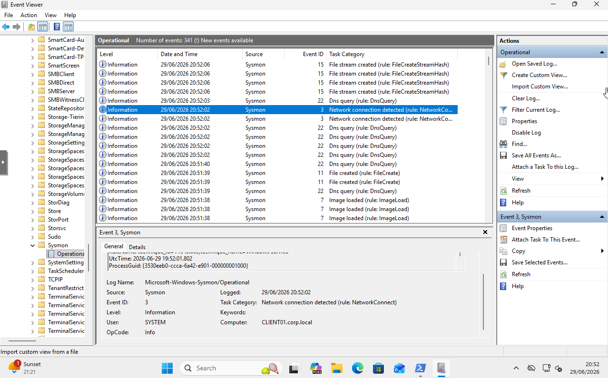
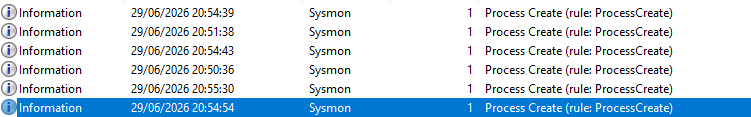
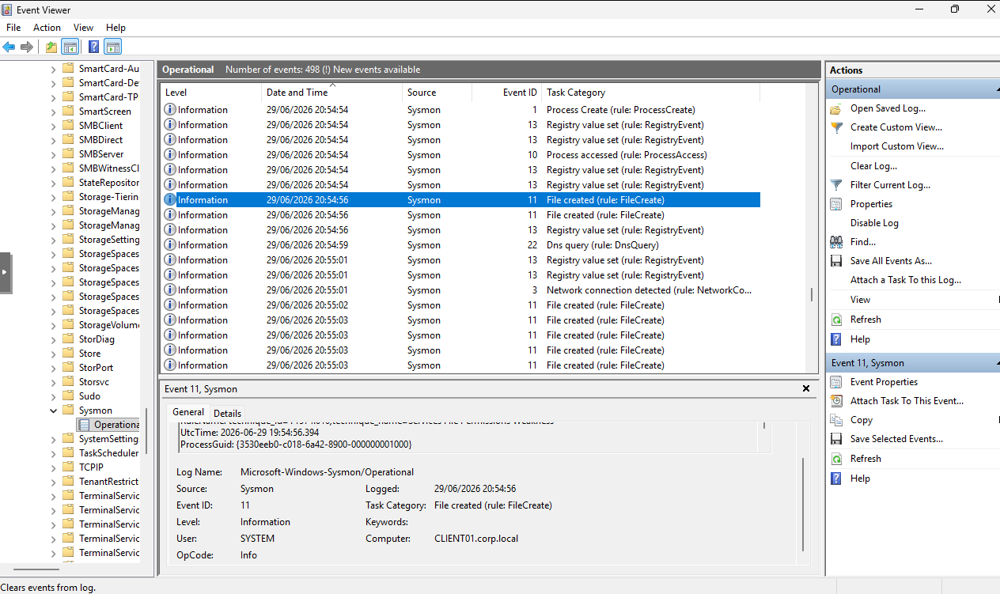

# Sysmon Endpoint Monitoring Deployment

## Overview

Following the implementation of Active Directory and security hardening controls, the next stage of the enterprise security monitoring lab was introducing endpoint visibility.

Windows provides native security logging through Event Viewer

However, additional telemetry is required to support detailed security investigations and threat detection for better incident response if required.

Sysmon which stands for (System Monitor) by Microsoft Sysinternals, was deployed across all Windows systems to provide enhanced endpoint monitoring capabilities.

The purpose of this phase was to simulate enterprise endpoint monitoring commonly performed by Security Operations Centre (SOC) teams.

Sysmon was used to provide visibility into:

- Process creation
- Network connections
- File creation activity
- Endpoint behaviour
- Security-relevant system activity

The telemetry collected during this phase would later be forwarded into the Wazuh SIEM platform for centralised analysis.

---

# Environment Scope

Sysmon was deployed across the Windows infrastructure within the enterprise simulation environment.

| Host | Role | Operating System |
|---|---|---|
| DC01 | Domain Controller | Windows Server 2022 |
| CLIENT01 | Domain Workstation | Windows 11 |
| CLIENT02 | Domain Workstation | Windows 11 |
| CLIENT03 | Domain Workstation | Windows 11 |

All endpoints were already:

- Connected to the `corp.local` Active Directory domain
- Configured with static IP addresses
- Managed through Group Policy

---

# Purpose of Sysmon

## Why Sysmon Was Implemented

Traditional Windows security logging provides useful information such as:

- User authentication events
- Account changes
- System events

However, it does not provide the level of detail required for endpoint investigation.

Sysmon extends Windows visibility by creating detailed telemetry about system activity.

Examples of visibility provided:

| Activity | Security Value |
|---|---|
| Process creation | Identifying suspicious applications or commands |
| Network connections | Detecting unusual outbound communication |
| File creation | Identifying dropped files or potential malware activity |
| Process relationships | Understanding execution chains |

This additional telemetry provides security analysts with greater context when investigating suspicious activity.

---

# Sysmon Deployment Preparation

The Sysmon executable and configuration file were prepared before deployment.

Required files:
(Sysmon64.exe)
(sysmonconfig.xml)

A consistent Sysmon configuration was used across all endpoints to ensure the same monitoring behaviour across the environment.

The files were transferred to each Windows machine before installation.

---

# Sysmon Installation

Sysmon was installed using the Microsoft Sysinternals Sysmon64 executable.

The following command was used:
- .\Sysmon64.exe -i .\sysmonconfig.xml

The `-i` parameter installs Sysmon as a Windows service and applies the provided configuration file.

Installation was completed on:

- DC01
- CLIENT01
- CLIENT02
- CLIENT03

This provided consistent endpoint telemetry collection across the Active Directory environment.

---

# Installation Validation

After installation, Sysmon was validated through Windows Event Viewer.

The Sysmon event channel is located at:
Event Viewer
- Applicatiopns and Services Logs
- Microsoft
- Windows
- Sysmon
- Operational

Successful event generation confirmed that Sysmon was running correctly and collecting endpoint activity.

---

# Endpoint Activity Testing

After confirming Sysmon was operational, controlled activity was generated on the endpoints to verify telemetry collection.

The following actions were performed:

- Opening Command Prompt
- Opening PowerShell
- Opening applications
- Creating files
- Generating normal user activity

The objective was to create observable events that could be reviewed within the Sysmon Operational log.

---

# Sysmon Event Analysis

The generated activity produced multiple Sysmon events.

The following event IDs were reviewed:

| Event ID | Description | Security Relevance |
|---|---|---|
| 1 | Process Creation | Provides visibility into executed processes and commands |
| 3 | Network Connection | Records outbound network communication |
| 11 | File Creation | Tracks files created on endpoints |

---

## Event ID 1 - Process Creation

Process creation events provide visibility into:

- Executed applications
- Command-line arguments
- Parent-child process relationships
- User context

Security use cases include:

- Detecting suspicious command execution
- Identifying abnormal PowerShell usage
- Investigating malware execution chains

---

## Event ID 3 - Network Connections

Network connection events record network communication generated by processes.

This can assist with identifying:

- Suspicious outbound connections
- Unusual application behaviour
- Potential command-and-control activity

---

## Event ID 11 - File Creation

File creation events provide visibility into newly created files.

Security use cases include:

- Detecting dropped malware files
- Monitoring suspicious scripts
- Investigating persistence attempts

---

# Environment-Wide Deployment

After successful validation on CLIENT01, Sysmon was deployed across the remaining Windows systems.

Deployment completed on:

- DC01
- CLIENT01
- CLIENT02
- CLIENT03

This ensured that endpoint telemetry was available across both:

- Domain infrastructure
- User workstations

---

# Enterprise Deployment Considerations

The deployment method used within this lab represents a manual baseline implementation.

In a production environment, Sysmon would typically be deployed using centralised management solutions such as:

- Group Policy
- Microsoft Intune
- Endpoint management platforms
- Software deployment systems

Centralised deployment allows organisations to:

- Maintain consistent configurations
- Apply configuration updates
- Scale monitoring across large environments

---

# Implementation Result

Completed:

- Sysmon deployed across Windows endpoints
- Endpoint telemetry successfully generated
- Process activity monitoring validated
- Network activity monitoring validated
- File activity monitoring validated

The security architecture now consisted of:

Identity Layer
- Active Directory
- Management Layer 
- Group Policy Security Controls
- Endpoint Visbility Layer
- Sysmon monitoring

The environment was now prepared for integration with a centralised Security Information and Event Management (SIEM) platform using Wazuh.
