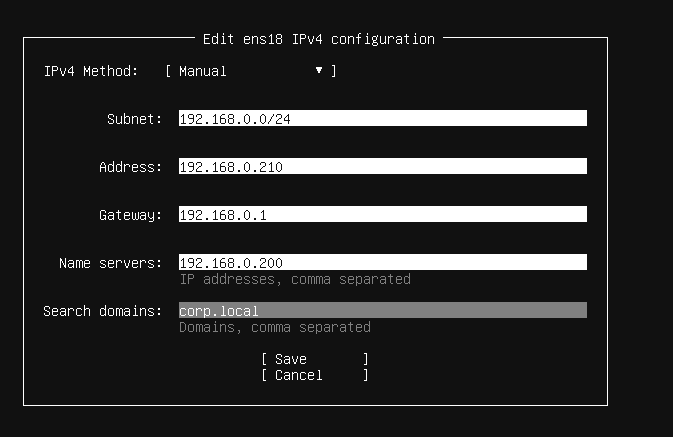
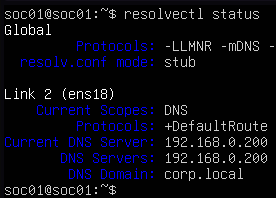
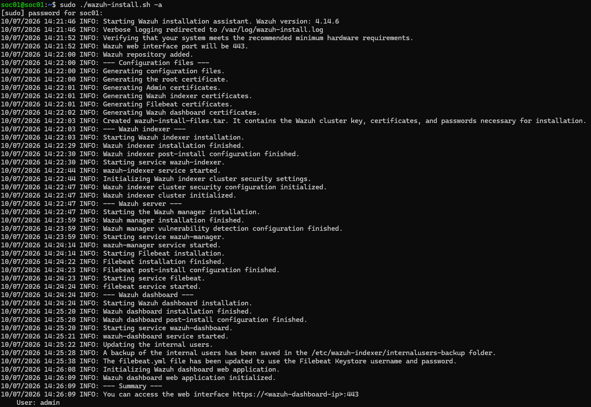
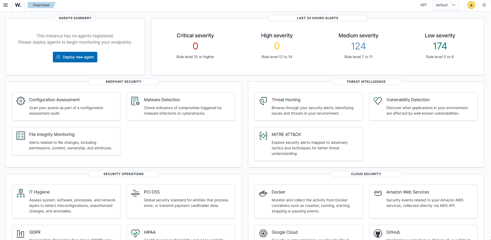
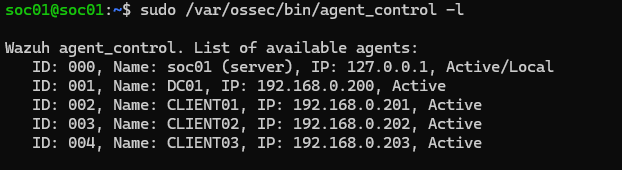
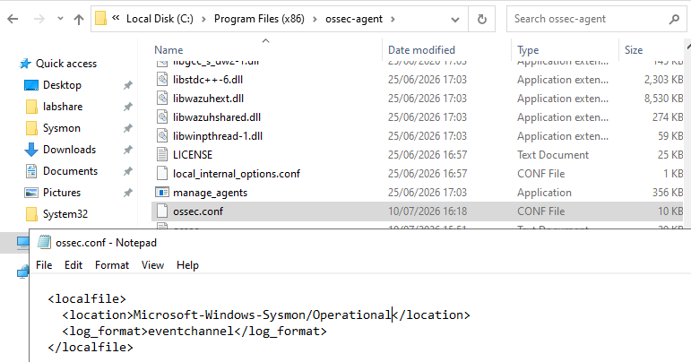
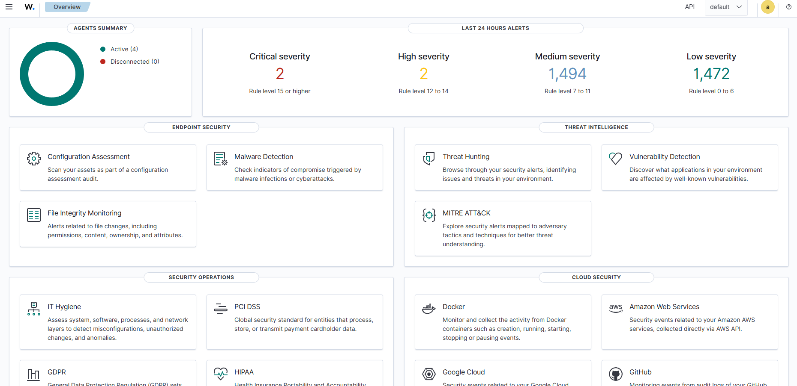

# Wazuh SIEM Deployment

## Overview

Following the deployment of Active Directory, security hardening controls, and endpoint telemetry collection through Sysmon, the next stage was implementing a centralised Security Information and Event Management (SIEM) platform.

A SIEM platform allows security teams to collect, analyse, and investigate security events from multiple systems through a single monitoring interface.

Wazuh was selected as the SIEM platform for this project due to its:

- Open-source availability
- Endpoint monitoring capabilities
- Security event analysis
- Agent-based architecture
- Integration with Windows security logs and Sysmon telemetry

The objective of this phase was to create a Security Operations Centre (SOC) style monitoring environment capable of receiving telemetry from the Windows enterprise environment.

---

# Environment Scope

The SIEM architecture consisted of a dedicated monitoring server and Windows endpoints.

| Host | Role | Operating System | IP Address |
|---|---|---|---|
| DC01 | Domain Controller | Windows Server 2022 | `192.168.0.200` |
| CLIENT01 | Domain Workstation | Windows 11 | `192.168.0.201` |
| CLIENT02 | Domain Workstation | Windows 11 | `192.168.0.202` |
| CLIENT03 | Domain Workstation | Windows 11 | `192.168.0.203` |
| SOC01 | Wazuh Security Monitoring Server | Ubuntu Server 24.04 | `192.168.0.210` |

`SOC01` was intentionally maintained as a standalone security monitoring server rather than being joined to the Active Directory domain.

This separation better represents enterprise security architecture where monitoring infrastructure is often separated from standard user environments.

---

# Wazuh Architecture

The completed monitoring architecture:

Windows Endpoints
- `DC01`
- `CLIENT01`
- `CLIENT02`
- `CLIENT03`
### which link to
- Wazuh Agents
### which links to
`SOC01`
- Wazuh Manager
- Wazuh Indexer
- Wazuh Dashboard
### which links to
Security Monitoring Interface

---

# SOC01 Deployment

## Ubuntu Server Installation

A dedicated Ubuntu Server virtual machine was deployed to act as the Security Operations monitoring platform.

The system was configured with:

Hostname:
`SOC01`

IP Address:
`192.168.0.210`

DNS Server:
`192.168.0.200`

The DNS configuration allowed `SOC01` to resolve internal domain resources while remaining independent from Active Directory authentication.

---

`SOC01` was configured with static network settings to provide predictable communication within the security monitoring environment.

---

## Network Validation

The following checks were performed:

- Confirmed hostname configuration
- Verified static IP assignment
- Confirmed DNS configuration
- Tested network communication with the environment

The following command was used:
`resolvectl status`

to verify DNS configuration.

---

---

# Wazuh Installation

Before installing Wazuh, the Ubuntu server was updated and required dependencies were installed.

Commands used:

`sudo apt update`

`sudo apt upgrade -y`

`sudo apt install curl gnupg apt-transport-https unzip -y`

---

# Wazuh Installation Assistant

The official Wazuh installation assistant was downloaded.

Command:
`curl -sO https://packages.wazuh.com/4.14/wazuh-install.sh`

The file was verified by doing:
`ls -lh wazuh-install.sh`

The installer permissions had to be alter to become executable:
`chmod +x wazuh-install.sh`

The installer help menu was checked to makesure the right commands were used:
`sudo ./wazuh-install.sh -h`

For this deployment, the all-in-one installation option was selected.

The following components were installed:

- Wazuh Manager
- Wazuh Indexer
- Wazuh Dashboard

Installation command:
`sudo ./wazuh-install.sh -a`

The installation completed successfully and provided access credentials for the Wazuh dashboard.

---

# Wazuh Dashboard Access

After installation completed, the Wazuh dashboard was accessed through a web browser.

Successful login confirmed that the SIEM platform was operational.

---

---

# Windows Endpoint Agent Deployment

To collect security telemetry from Windows systems, Wazuh agents were deployed across all endpoints.

Agents were installed on:

- `DC01`
- `CLIENT01`
- `CLIENT02`
- `CLIENT03`

Each agent was configured to communicate with the Wazuh Manager:
`192.168.0.210`

---

The deployment process included:

1. Installing Wazuh Agent
2. Registering the endpoint
3. Configuring manager communication and providing authentication key
4. Validating agent connection

---

# Agent Validation

After installation, endpoint registration was verified from SOC01.

Command used:

`sudo /var/ossec/bin/agent_control -l`

The output confirmed that all Windows systems were successfully communicating with Wazuh.

---

---

# Sysmon Telemetry Integration

The next step was forwarding Sysmon telemetry into Wazuh.

The monitoring flow:
Windows Endpoint
- Sysmon
- Wazuh Agent
- Wazuh Manager
- Dashboard

---

The Wazuh agent configuration file was modified:

Location: `C:\Program Files (x86)\ossec-agent\ossec.conf`

The following configuration was added:

`<localfile>`
`  <location>Microsoft-Windows-Sysmon/Operational</location>`
`  <log_format>eventchannel</log_format>`
`</localfile>`

This configuration instructs the Wazuh agent to monitor the Sysmon Operational event channel and forward collected telemetry.

---

#Telemetry Validation

After configuring Sysmon event collection, endpoint activity was generated to confirm successful ingestion.

Testing activity included:

Opening PowerShell
Creating processes
Generating Windows events

The resulting events were visible within the Wazuh dashboard.

