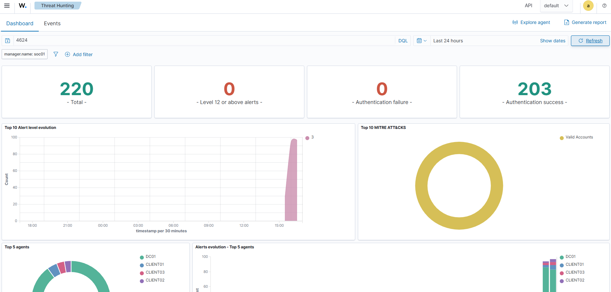
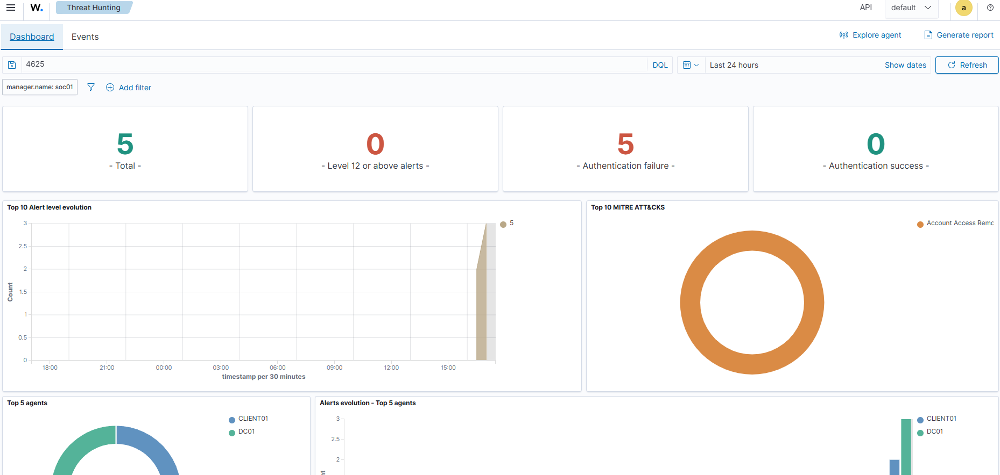
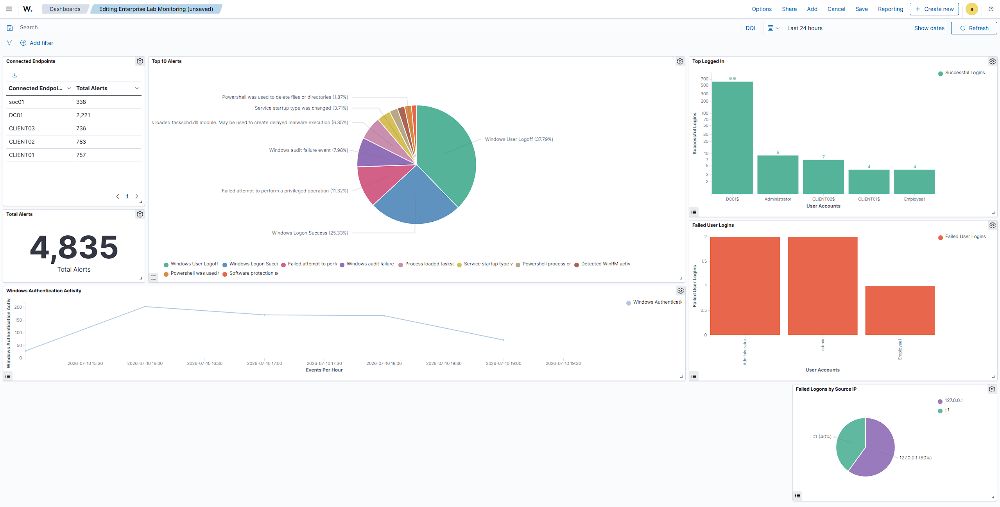
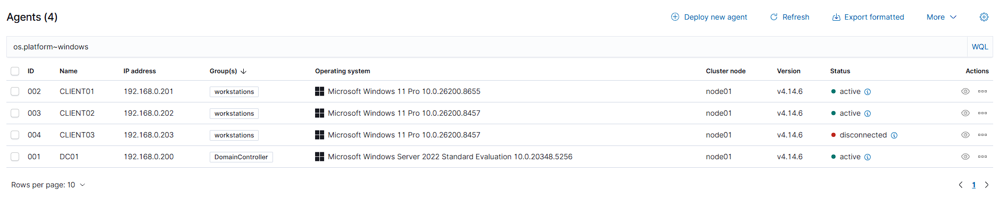
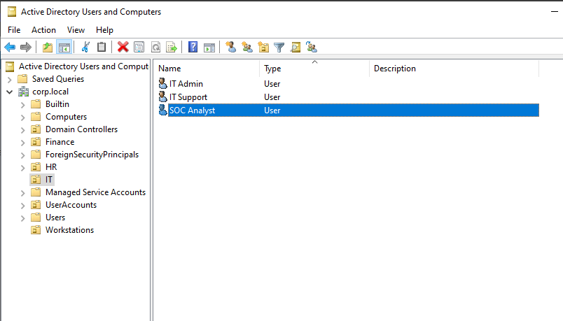

# Windows Security Event Collection

In addition to collecting Sysmon telemetry, Wazuh was configured to ingest native Windows Security Event Logs from each endpoint.

This provides visibility into authentication activity, privilege assignments and account management events alongside the enhanced endpoint telemetry provided by Sysmon.

The following Windows Security Event IDs were validated throughout the environment:

| Event ID | Description |
|:---------|:------------|
| 4624 | Successful logon |
| 4625 | Failed logon |
| 4672 | Special privileges assigned |
| 4720 | User account created |

These events provide a foundation for monitoring authentication activity and detecting suspicious behaviour within the Active Directory environment.

---

# Authentication Monitoring

Authentication activity is one of the most valuable sources of telemetry within a Security Operations Centre (SOC). Monitoring both successful and failed authentication attempts allows analysts to identify compromised credentials, password attacks and unusual login behaviour.

---

## Successful Authentication Events

Successful logins were validated by searching for **Event ID 4624** within Wazuh.

This confirmed that Windows Security Events were successfully being collected from the domain environment.

The following information becomes available to analysts:

- User account
- Source workstation
- Authentication time
- Authentication type
- Logon session

---

## Failed Authentication Events

Failed authentication attempts were intentionally generated by entering incorrect credentials on multiple domain accounts.

This produced **Event ID 4625**, confirming that failed login attempts were successfully forwarded into the SIEM.

This type of monitoring is commonly used to detect:

- Password guessing
- Brute-force attacks
- Password spraying
- Invalid credential usage

---

# Enterprise Security Dashboard

Once endpoint telemetry and Windows Security Events were successfully collected, a custom Wazuh dashboard was created to provide a centralised overview of the environment.

The dashboard was designed to surface high-value information that a SOC analyst would typically review during day-to-day monitoring.

Dashboard widgets included:

- Connected Endpoints
- Total Security Alerts
- Top Alert Categories
- Successful Authentication Activity
- Failed Authentication Activity
- Authentication Trends
- Failed Logons by Source IP Address

These widgets provide immediate visibility into endpoint health, authentication behaviour and abnormal activity across the environment.

---

# Endpoint Organisation

To improve scalability and prepare the environment for future expansion, monitored systems were organised into logical endpoint groups.

Groups created included:

- Domain Controllers
- Workstations

Grouping endpoints allows monitoring policies and detection rules to be applied based on system role rather than individual machines.

This reflects how larger enterprise environments commonly organise monitored assets.

---

# Establishing a Security Baseline

Before introducing simulated attacks, it is important to understand what normal activity looks like within the environment.

A baseline of expected behaviour was established by reviewing:

- Normal user authentication
- Administrative logins
- Endpoint activity
- Routine Windows Security Events
- Sysmon process creation events

Establishing a baseline allows security analysts to more easily identify unusual behaviour once attack simulations are introduced in later phases of the project.

---

# Detection Use Cases

Although this phase focuses on monitoring infrastructure rather than attack simulation, several common detection scenarios were identified to demonstrate how collected telemetry could be investigated within a SOC environment.

---

## Failed Authentication Monitoring

### Objective

Identify authentication behaviour that may indicate attempts to gain unauthorised access.

Potential attack scenarios include:

- Brute-force attacks
- Password spraying
- Credential stuffing
- Invalid credential usage

### Data Source

Windows Security Event Log

**Event ID:** 4625

Collected through:

Windows Endpoint

↓

Wazuh Agent

↓

Wazuh Manager

↓

Wazuh Dashboard

### Investigation

During investigation an analyst would review:

- Target username
- Source IP address
- Source workstation
- Number of failed attempts
- Authentication timeline
- Subsequent successful logins

### Potential Response

Possible response actions include:

- Validate account ownership
- Reset compromised credentials
- Investigate the originating endpoint
- Review related authentication events
- Escalate where appropriate

---

## Privileged Account Monitoring

### Objective

Monitor privileged account activity across the environment.

Administrative accounts represent high-value targets and should receive additional monitoring.

### Data Sources

Windows Security Event Log

- Event ID 4624
- Event ID 4672

### Investigation

Review:

- Account used
- Source workstation
- Login time
- Privileges assigned
- Activity following authentication

### Potential Response

Possible analyst actions include:

- Validate administrator activity
- Investigate suspicious privilege usage
- Review additional endpoint activity
- Remove unnecessary permissions if required

---

# SOC Analyst Account

To improve realism, a dedicated **SOC Analyst** account was created within Active Directory.

The account was intentionally configured as a standard domain user rather than a Domain Administrator.

This follows the Principle of Least Privilege, ensuring analysts receive only the permissions required to perform monitoring activities.

---

# Phase Summary

This phase transformed the Active Directory environment into a centralised security monitoring platform capable of collecting endpoint telemetry and Windows Security Events.

The completed implementation includes:

- Dedicated Wazuh monitoring server
- Windows endpoint monitoring
- Sysmon integration
- Windows Security Event collection
- Centralised SIEM
- Authentication monitoring
- Enterprise monitoring dashboard
- Endpoint grouping
- Security baseline established

---

# Monitoring Architecture

Active Directory 
- Windows Endpoints: (DC01, CLIENT01, CLIENT02, CLIENT03)
- Sysmon Events
- Wazuh Agents
- SOC01: (Wazuh Manager / Indexer)
- Wazuh Dashboard

---

# Next Phase

With endpoint telemetry now centralised and validated, the next phase focuses on introducing realistic attack simulations into the environment.

Upcoming scenarios include:

- Brute-force authentication attacks
- Suspicious PowerShell execution
- User account creation
- Privilege escalation
- Persistence techniques
- Incident investigation workflows

These scenarios will demonstrate how the monitoring platform can be used to detect, investigate and respond to common enterprise security incidents.
